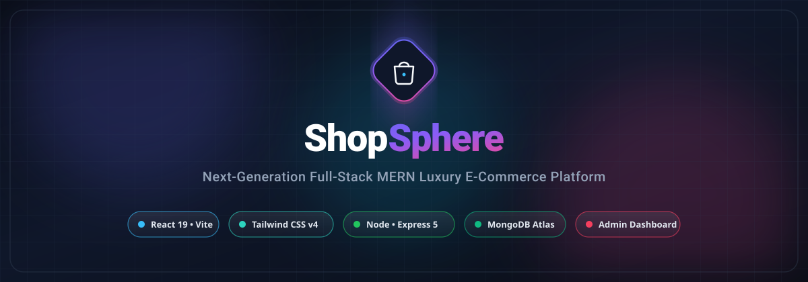
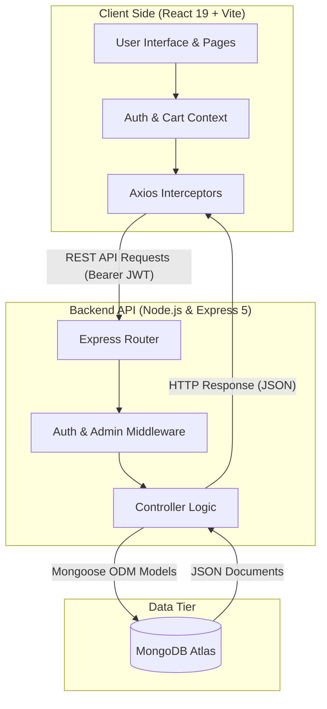

<div align="center">

  

  <br />
  <br />

  <h1>🛍️ ShopSphere — Modern Full-Stack MERN E-Commerce Platform</h1>

  <p align="center">
    <strong>A high-performance, responsive, luxury e-commerce ecosystem built with React 19, Tailwind CSS v4, Node.js, Express, and MongoDB Atlas.</strong>
  </p>

  <p align="center">
    <a href="#-key-features">Explore Features</a> •
    <a href="#-system-architecture">Architecture</a> •
    <a href="#-tech-stack">Tech Stack</a> •
    <a href="#-getting-started">Getting Started</a> •
    <a href="#-api-reference">API Endpoints</a> •
    <a href="#-admin-dashboard">Admin Suite</a>
  </p>

  <p align="center">
    
    
    
    
    
    
    
    
  </p>

</div>

---

## 📌 Table of Contents

- [✨ Overview](#-overview)
- [🚀 Key Features](#-key-features)
  - [Customer Experience](#-customer-experience)
  - [Administrative Suite](#-administrative-suite)
  - [Security & Performance](#-security--performance)
- [🛠️ Tech Stack Matrix](#-tech-stack-matrix)
- [🏛️ System Architecture](#-system-architecture)
- [📂 Project Directory Structure](#-project-directory-structure)
- [⚡ Getting Started & Installation](#-getting-started--installation)
  - [1. Prerequisites](#1-prerequisites)
  - [2. Clone Repository](#2-clone-repository)
  - [3. Backend Configuration](#3-backend-configuration)
  - [4. Seed Database (Optional)](#4-seed-database-optional)
  - [5. Frontend Setup](#5-frontend-setup)
- [📡 RESTful API Reference](#-restful-api-reference)
- [🔐 Authentication & Role-Based Access](#-authentication--role-based-access)
- [🌟 UI / UX Highlights](#-ui--ux-highlights)
- [🤝 Contributing](#-contributing)
- [📄 License](#-license)

---

## ✨ Overview

**ShopSphere** is an end-to-end luxury e-commerce web application engineered for speed, aesthetics, and reliability. Designed with a dual-sidebar layout (sticky quick navigation menu on the left and a sliding cart drawer on the right), ShopSphere delivers a frictionless shopping experience.

Under the hood, it features a modular architecture combining **React 19** and **Vite** on the frontend with **Express 5** and **MongoDB Atlas** on the backend. Authentication is enforced via **JWT with bcrypt hashing**, while the UI is styled using **Tailwind CSS v4** and animated smoothly with **Framer Motion**.

---

## 🚀 Key Features

### 🛍️ Customer Experience

<table>
  <tr>
    <td width="50%">
      <h4>🎯 Modern Product Catalog & Search</h4>
      <ul>
        <li>Real-time instant live search by product name & description.</li>
        <li>Dynamic category filtering (Electronics, Clothing, Accessories, etc.).</li>
        <li>Price range sliders, rating filters, and sorting (Price, Newest, Top Rated).</li>
      </ul>
    </td>
    <td width="50%">
      <h4>⚡ Dual-Sidebar Navigation</h4>
      <ul>
        <li><strong>Left Sidebar:</strong> Instant collapsible navigation menu for fast switching between pages.</li>
        <li><strong>Right Sidebar:</strong> Interactive mini-cart drawer with live subtotals, quantity adjusters, and direct checkout link.</li>
      </ul>
    </td>
  </tr>
  <tr>
    <td width="50%">
      <h4>❤️ Wishlist & Customer Reviews</h4>
      <ul>
        <li>1-click interactive wishlist toggle saved directly to user profile in MongoDB.</li>
        <li>Verified customer ratings, text reviews, and star breakdown on product details.</li>
      </ul>
    </td>
    <td width="50%">
      <h4>💳 Smooth Checkout & Order Tracking</h4>
      <ul>
        <li>Multi-step checkout with delivery address and payment method selection.</li>
        <li>Personal order history page with badge statuses (<code>Pending</code>, <code>Paid</code>, <code>Delivered</code>).</li>
      </ul>
    </td>
  </tr>
</table>

### 🛡️ Administrative Suite

ShopSphere comes equipped with a protected, role-based **Admin Control Center** (`/admin`):

- **📊 Real-time Dashboard Metrics**: Total sales revenue, orders count, product inventory levels, and active registered users.
- **📦 Inventory & Product Management (CRUD)**: Create new products with image URLs, modify prices, update stock levels, or delete items.
- **🚚 Order Fulfillment System**: Mark orders as paid or delivered with live status updates.
- **👥 User Administration**: Inspect registered customers, manage user accounts, and assign permissions.

### 🔒 Security & Performance

- **Stateless Authentication**: Signed JSON Web Tokens (JWT) stored securely and transmitted via Axios request interceptors.
- **Password Protection**: Salted bcrypt password hashing before database persistence.
- **Role-Based Authorization Middleware**: Strict route guards for regular users (`protect`) and store managers (`admin`).
- **Data Validation & Error Handling**: Centralized error middleware providing readable error responses.

---

## 🛠️ Tech Stack Matrix

### Frontend Architecture

| Technology | Version | Purpose |
| :--- | :--- | :--- |
| **[React](https://react.dev/)** | `^19.2.7` | Modern declarative component-driven user interface |
| **[Vite](https://vitejs.dev/)** | `^8.1.1` | Next-generation lightning-fast build tool and dev server |
| **[Tailwind CSS](https://tailwindcss.com/)** | `^4.3.2` | Utility-first styling framework with modern color palettes |
| **[Framer Motion](https://www.framer.com/motion/)** | `^12.42.2` | Fluid micro-interactions, page transitions, and drawer physics |
| **[Lucide React](https://lucide.dev/)** | `^1.29.0` | Clean, lightweight icon suite |
| **[React Router DOM](https://reactrouter.com/)** | `^7.18.1` | Declarative routing with nested protected routes |
| **[Axios](https://axios-http.com/)** | `^1.18.1` | HTTP client with automatic JWT token attachment interceptors |

### Backend Architecture

| Technology | Version | Purpose |
| :--- | :--- | :--- |
| **[Node.js](https://nodejs.org/)** | `>= 18.x` | Asynchronous JavaScript runtime environment |
| **[Express](https://expressjs.com/)** | `^5.2.1` | Fast, unopinionated REST API web framework |
| **[MongoDB](https://www.mongodb.com/)** | Atlas / Cloud | Scalable NoSQL document database |
| **[Mongoose](https://mongoosejs.com/)** | `^9.7.4` | Elegant object data modeling (ODM) for MongoDB |
| **[JSON Web Token (JWT)](https://jwt.io/)** | `^9.0.3` | Cryptographic signed authentication tokens |
| **[Bcrypt.js](https://github.com/dcodeIO/bcrypt.js)** | `^3.0.3` | One-way salted hashing algorithm for user passwords |
| **[CORS](https://github.com/expressjs/cors)** | `^2.8.6` | Cross-Origin Resource Sharing middleware |
| **[Dotenv](https://github.com/motdotla/dotenv)** | `^17.4.2` | Environment variables manager |

---

## 🏛️ System Architecture



---

## 📂 Project Directory Structure

```text
shopsphere/
├── assets/
│   └── banner.svg                  # Vector README branding banner
├── ecommerce-mern/
│   └── backend/                    # Express REST API Server
│       ├── config/
│       │   └── db.js               # MongoDB connection handler
│       ├── controllers/
│       │   ├── authController.js   # User registration, login, profile, wishlist
│       │   ├── categoryController.js # Category management
│       │   ├── orderController.js  # Order processing & statuses
│       │   └── productController.js# Product CRUD & reviews
│       ├── middleware/
│       │   ├── authMiddleware.js   # JWT verification & role validation
│       │   └── errorMiddleware.js  # 404 & centralized error handler
│       ├── models/
│       │   ├── Category.js         # Category schema
│       │   ├── Order.js            # Order schema
│       │   ├── Product.js          # Product schema
│       │   └── User.js             # User schema with roles & wishlist
│       ├── routes/
│       │   ├── authRoutes.js       # Auth & user management endpoints
│       │   ├── categoryRoutes.js   # Category endpoints
│       │   ├── orderRoutes.js      # Order endpoints
│       │   └── productRoutes.js    # Product & review endpoints
│       ├── .env.example            # Sample environment variables
│       ├── package.json            # Backend dependencies & scripts
│       ├── seeder.js               # Database population script
│       └── server.js               # Express application entry point
└── frontend/                       # React 19 Frontend Client
    ├── public/                     # Static icons & assets
    ├── src/
    │   ├── api/
    │   │   └── api.js              # Axios instance with interceptors
    │   ├── components/
    │   │   ├── AdminRoute.jsx      # Guard for admin-only routes
    │   │   ├── Footer.jsx          # Trust badges & footer pillars
    │   │   ├── Navbar.jsx          # Header with search & sidebars triggers
    │   │   ├── PrivateRoute.jsx    # Guard for logged-in users
    │   │   ├── SidebarLeft.jsx     # Slide navigation drawer
    │   │   └── SidebarRight.jsx    # Slide mini-cart drawer
    │   ├── context/
    │   │   ├── AuthContext.jsx     # Global authentication state
    │   │   ├── CartContext.jsx     # Global cart state & actions
    │   │   └── ToastContext.jsx    # Global notification alerts
    │   ├── pages/
    │   │   ├── AdminDashboard.jsx  # Admin analytics & CRUD controls
    │   │   ├── Cart.jsx            # Detailed cart view
    │   │   ├── Checkout.jsx        # Multi-step checkout process
    │   │   ├── ForgotPassword.jsx  # Account password recovery
    │   │   ├── Home.jsx            # Landing page with hero & featured items
    │   │   ├── Login.jsx           # User authentication form
    │   │   ├── NotFound.jsx        # 404 error page
    │   │   ├── OrderDetail.jsx     # Detailed receipt & tracking view
    │   │   ├── Orders.jsx          # List of user orders
    │   │   ├── ProductDetail.jsx   # Product info, gallery & review submissions
    │   │   ├── Profile.jsx         # Profile settings & shipping address
    │   │   ├── Register.jsx        # New user sign-up
    │   │   ├── Shop.jsx            # Full shop with search & multi-filters
    │   │   └── Wishlist.jsx        # Saved wishlist items
    │   ├── App.jsx                 # Route configurations & layout
    │   ├── index.css               # Tailwind CSS v4 root imports
    │   └── main.jsx                # Application root entry point
    ├── index.html                  # HTML5 template with Google fonts
    ├── package.json                # Frontend dependencies & scripts
    └── vite.config.js              # Vite configuration
```

---

## ⚡ Getting Started & Installation

Follow these instructions to configure and run the application locally on your machine.

### 1. Prerequisites

Ensure you have installed:
- **[Node.js](https://nodejs.org/)** (v18.0.0 or higher recommended)
- **[Git](https://git-scm.com/)**
- **[MongoDB](https://www.mongodb.com/)** (Local instance or free MongoDB Atlas cluster)

### 2. Clone Repository

```bash
git clone https://github.com/usaaman/shopsphere.git
cd shopsphere
```

---

### 3. Backend Configuration

Navigate to the backend directory and install dependencies:

```bash
cd ecommerce-mern/backend
npm install
```

Create a `.env` configuration file in `ecommerce-mern/backend`:

```bash
cp .env.example .env
```

Open `.env` and configure your credentials:

```env
PORT=5000
MONGO_URI=mongodb+srv://<username>:<password>@cluster.mongodb.net/shopsphere?retryWrites=true&w=majority
JWT_SECRET=your_super_secret_jwt_key_here
```

Start the backend server in development mode:

```bash
npm run dev
```

> **API Server will be active on:** `http://localhost:5000`

---

### 4. Seed Database (Optional)

To quickly populate your MongoDB database with sample categories and products:

```bash
# Inside ecommerce-mern/backend
node seeder.js
```

*(To remove all seeded data, run: `node seeder.js -d`)*

---

### 5. Frontend Setup

Open a new terminal window, navigate to the frontend folder, and install dependencies:

```bash
cd frontend
npm install
```

Start the Vite development server:

```bash
npm run dev
```

> **Frontend Application will be available at:** `http://localhost:5173`

---

## 📡 RESTful API Reference

### 🔐 Authentication & User Endpoints (`/api/auth`)

| Method | Endpoint | Description | Access |
| :---: | :--- | :--- | :---: |
| <kbd>POST</kbd> | `/api/auth/register` | Register new user account | Public |
| <kbd>POST</kbd> | `/api/auth/login` | Authenticate user & return JWT token | Public |
| <kbd>POST</kbd> | `/api/auth/forgot-password` | Password recovery request | Public |
| <kbd>GET</kbd> | `/api/auth/profile` | Retrieve logged-in user profile | `Private` |
| <kbd>PUT</kbd> | `/api/auth/profile` | Update profile details (Name, Address, Phone) | `Private` |
| <kbd>POST</kbd> | `/api/auth/wishlist/:id` | Add or remove product from user wishlist | `Private` |
| <kbd>GET</kbd> | `/api/auth/users` | List all users | `Private / Admin` |
| <kbd>PUT</kbd> | `/api/auth/users/:id` | Update user role or information | `Private / Admin` |
| <kbd>DELETE</kbd> | `/api/auth/users/:id` | Remove user account | `Private / Admin` |

### 🛍️ Product Endpoints (`/api/products`)

| Method | Endpoint | Description | Access |
| :---: | :--- | :--- | :---: |
| <kbd>GET</kbd> | `/api/products` | Get products with search, filter, and pagination | Public |
| <kbd>GET</kbd> | `/api/products/:id` | Get single product details by ID | Public |
| <kbd>POST</kbd> | `/api/products` | Create a new product | `Private / Admin` |
| <kbd>PUT</kbd> | `/api/products/:id` | Update product details | `Private / Admin` |
| <kbd>DELETE</kbd> | `/api/products/:id` | Delete product | `Private / Admin` |
| <kbd>POST</kbd> | `/api/products/:id/reviews` | Create customer rating and review | `Private` |

### 📂 Category Endpoints (`/api/categories`)

| Method | Endpoint | Description | Access |
| :---: | :--- | :--- | :---: |
| <kbd>GET</kbd> | `/api/categories` | Retrieve all categories | Public |
| <kbd>GET</kbd> | `/api/categories/:id` | Get single category by ID | Public |
| <kbd>POST</kbd> | `/api/categories` | Create new category | `Private / Admin` |
| <kbd>PUT</kbd> | `/api/categories/:id` | Update category details | `Private / Admin` |
| <kbd>DELETE</kbd> | `/api/categories/:id` | Delete category | `Private / Admin` |

### 📦 Order Endpoints (`/api/orders`)

| Method | Endpoint | Description | Access |
| :---: | :--- | :--- | :---: |
| <kbd>POST</kbd> | `/api/orders` | Place a new customer order | `Private` |
| <kbd>GET</kbd> | `/api/orders/myorders` | Retrieve authenticated user's orders | `Private` |
| <kbd>GET</kbd> | `/api/orders/:id` | Get detailed order summary by ID | `Private` |
| <kbd>GET</kbd> | `/api/orders` | Retrieve all orders across the platform | `Private / Admin` |
| <kbd>PUT</kbd> | `/api/orders/:id/pay` | Mark order status as paid | `Private` |
| <kbd>PUT</kbd> | `/api/orders/:id/deliver` | Update order delivery status | `Private / Admin` |

---

## 🔐 Authentication & Role-Based Access

ShopSphere manages client and admin privileges through granular middleware:

<details>
<summary><strong>👉 Click to expand Authentication Flow Details</strong></summary>
<br />

1. **Client Login:** When a user logs in via `/api/auth/login`, the server validates the encrypted password using `bcrypt.compare()`.
2. **Token Generation:** A signed JWT payload containing the user's `id` and `role` is generated with an expiration period.
3. **Client Storage:** The frontend preserves this token in `localStorage` under key `user`.
4. **Axios Interceptor:** Every outgoing API request is intercepted by `src/api/api.js` to automatically attach the header:
   ```http
   Authorization: Bearer <JWT_TOKEN>
   ```
5. **Route Protection:**
   - **`protect` Middleware**: Verifies token validity using `jwt.verify()` and attaches the user model to `req.user`.
   - **`admin` Middleware**: Validates that `req.user.role === 'admin'`. Non-admin accounts attempting access receive a `403 Forbidden`.
</details>

---

## 🌟 UI / UX Highlights

- 🎨 **Sleek Aesthetic**: Clean slate background (`#F8FAFD`), dark contrasting text, and vibrant gradient accents.
- ⚡ **Micro-Interactions**: Hover scales, drawer slide-overs, and button feedback powered by Framer Motion.
- 📱 **Adaptive Layout**: Responsive grid layouts that adapt seamlessly from mobile devices to ultra-wide 4K monitors.
- 💬 **Interactive Feedback**: Instant toast notifications for cart updates, login alerts, and checkout validations.

---

## 🤝 Contributing

Contributions make the open-source community an inspiring place to learn and build! Any contributions you make are **greatly appreciated**.

1. **Fork** the Project
2. **Create** your Feature Branch (`git checkout -b feature/AmazingFeature`)
3. **Commit** your Changes (`git commit -m 'feat: add some AmazingFeature'`)
4. **Push** to the Branch (`git push origin feature/AmazingFeature`)
5. **Open** a Pull Request

---

## 📄 License

Distributed under the **ISC License**. See `LICENSE` for more information.

---

<div align="center">
  <p>Crafted with ❤️ by <a href="https://github.com/usaaman"><strong>Usman</strong></a></p>
  <p>
    <a href="#top"><strong>⬆ Back to Top</strong></a>
  </p>
</div>
